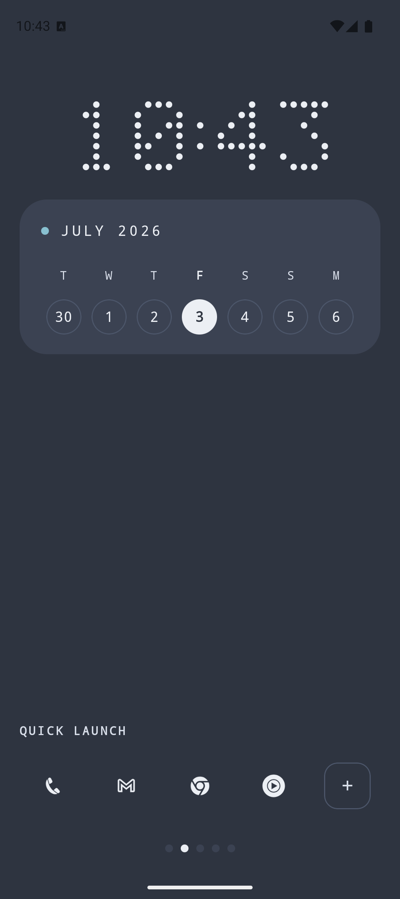
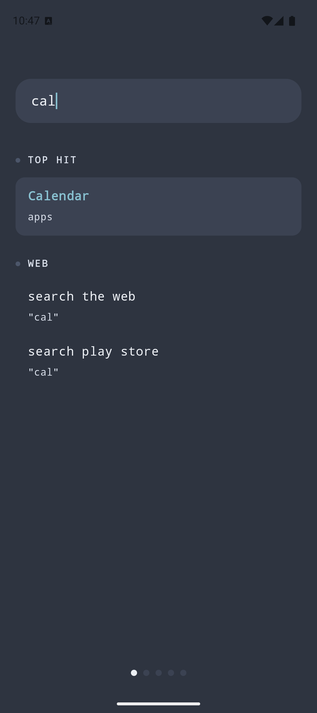
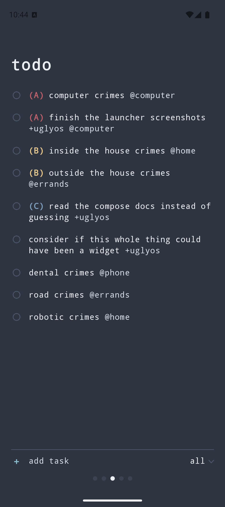
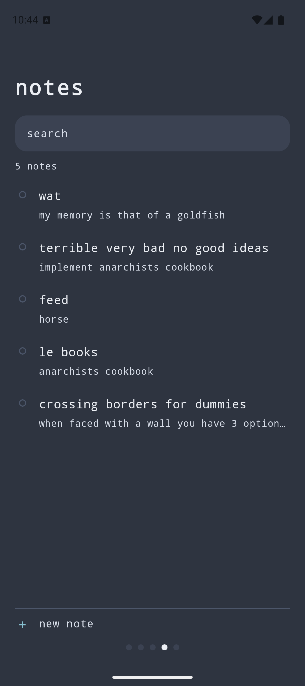
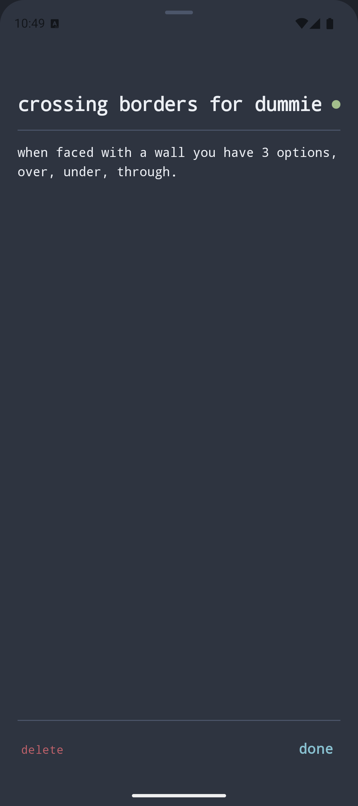
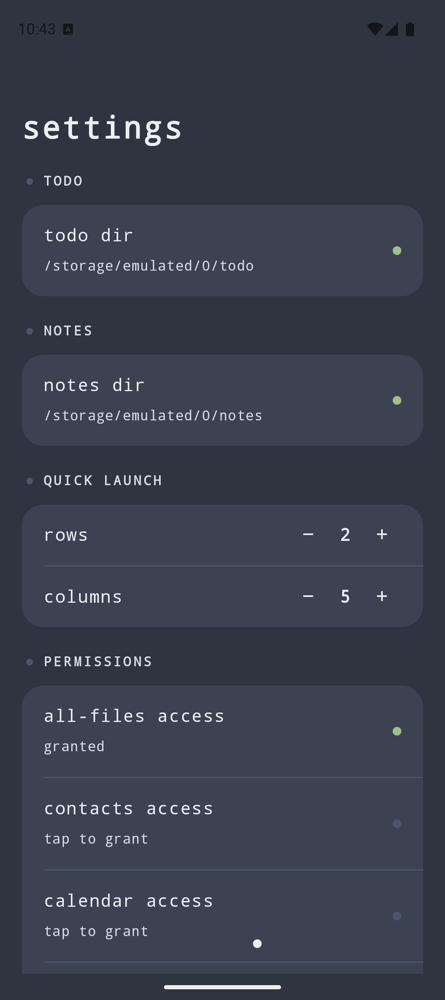

# ugly launcher

A custom Android home-screen launcher. Kotlin + Jetpack Compose.

## Screenshots

<table>
  <tr>
    <td align="center"><br>home</td>
    <td align="center"><br>search</td>
    <td align="center"><br>todo</td>
  </tr>
  <tr>
    <td align="center"><br>notes</td>
    <td align="center"><br>notes editor</td>
    <td align="center"><br>settings</td>
  </tr>
</table>

## Commands

Run from the repo root:

```
just build      # build debug APK
just install    # build + install to connected device
just emulate    # boot a Pixel 9a emulator + install/launch on it
just dev        # watch sources, reinstall + relaunch on change
just test       # run unit tests
```

- `just emulate` creates (once) and boots a `ugly_pixel_9a` AVD, installs the
  launcher as default home, and stays attached until Ctrl-C (an emulator already
  running when you invoked it is left up). Needs the Android SDK command-line
  tools — on Arch: `yay -S android-sdk-cmdline-tools-latest`. The system image
  auto-installs on first run.
- `just dev` needs `watchexec`. Not true hot reload (Compose Live Edit is Android
  Studio only), but it reinstalls + relaunches on every `.kt`/`.xml` change.

APK output: `app/build/outputs/apk/debug/app-debug.apk`

## Basics

- Package `com.uglyos.launcher`. minSdk 30, compileSdk 35.
- Set as default: home button → pick "ugly launcher". Revert: Settings → Apps →
  Default apps → Home app.
- Pages, left to right: search, home, todo, notes, settings.
- The todo and notes dirs (set in settings) hold `todo.txt`/`done.txt` and the
  `.md` files. Reading arbitrary paths needs all-files access
  (`MANAGE_EXTERNAL_STORAGE`). Settings persist in `ugly_launcher` prefs.

## Layout

- `app/src/main/java/com/uglyos/launcher/MainActivity.kt` — home screen + app drawer
- `Shortcuts.kt` — home-screen quick-launch dock (pinned apps)
- `QuickLaunchStore.kt` — dock pins + grid-size persistence
- `AppGlyph.kt` — monochrome app-icon glyph, shared by drawer + dock
- `Settings.kt` — settings page + persisted config
- `TodoPage.kt` — interactive todo.txt page with mode switcher
- `TodoModeStore.kt` — user-defined todo modes (filters) + selected-mode persistence
- `NotesPage.kt` — markdown notes page: list/search + full-screen editor
- `Search.kt` — global spotlight-style search (left of home)
- `DateTimeWidget.kt` — home clock, calendar card, now-playing bar, next-event line
- `NextEvent.kt` — reads the next calendar event via the calendar provider
- `MediaControl.kt` — reads/controls the active media session
- `Frecency.kt` — per-app launch history feeding search ranking
- `AndroidManifest.xml` — registers as HOME, queries launchable apps
- `res/` — icon (adaptive, Nord-themed monkey), theme, strings
- `common/` — shared module (Nord theme, todo.txt + notes libraries); see `common/README.md`

## Features

- **Home** — dot-matrix clock, calendar card, and a next-event stack: up to three
  of the next hour's events with live countdowns, hidden when the hour is clear.
  Source calendars are chosen in settings.
- **Now playing** — a control between the calendar card and next-event stack,
  shown only when a media session is live: title, artist, prev / play-pause /
  next. Needs notification-listener access (settings → permissions → media
  controls).
- **Quick launch** — a dock of pinned apps as monochrome glyphs on a fixed grid
  (default 2 × 5). Tap launches, long-press removes, `+` pins. Seeded on first
  run, then whatever you pin. Persists in `quick_launch` prefs.
- **Search** — fans the query out to independent providers (apps, settings,
  contacts, web fallback) and ranks all hits on one scale; the top hit opens on
  Enter. Graded fuzzy scoring plus a frecency boost (`frecency` prefs, ~3-day
  half-life). Add a source via another provider in `Search.kt`.
- **Todo** — one page over `todo_dir/todo.txt`. The footer names the active mode;
  tap to switch, long-press to edit or delete, "add mode" to create one. Modes
  filter on a `+project`, an `@context`, or both — or the inverse. A scoped mode
  hides its own tag per row and auto-appends it to tasks added there. Add / edit /
  complete tasks (done archived to `done.txt`); live-reload via `FileObserver`.
  Modes persist in `todo_modes` prefs.
- **Notes** — a page over `notes_dir`, one `<title>.md` per note, newest-modified
  first; a search field narrows by title or body. Stays light on large dirs:
  the list reads only each note's preview line, search streams files one at a
  time, and a body loads only when opened. Tap opens a full-screen editor;
  "new note" opens a blank one; the editor's armed delete removes it. Edits
  autosave (on pause, close, and background) — no save button, just `done` to
  dismiss. Writes/deletes run off the main thread; live-reload via `FileObserver`.
- **Settings** — grouped by signpost (data, quick launch, permissions, next
  event). Permissions requested inline, routing to system settings once
  permanently denied.
